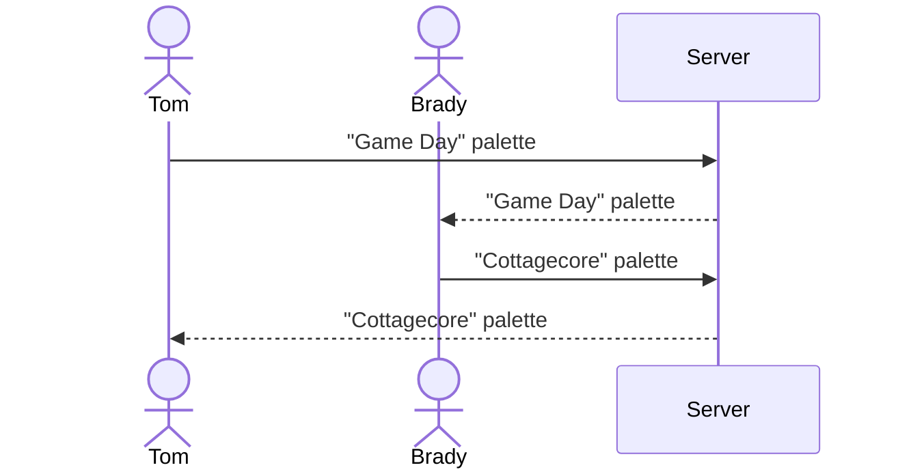

# Tint-Hint

[My Notes](notes.md)

Tint-Hint is a pallette generator that can randomly generate colors and save them to a user's gallery to be shared along with other recent users' palletes.

> [!NOTE]
>  This is a template for your startup application. You must modify this `README.md` file for each phase of your development. You only need to fill in the section for each deliverable when that deliverable is submitted in Canvas. Without completing the section for a deliverable, the TA will not know what to look for when grading your submission. Feel free to add additional information to each deliverable description, but make sure you at least have the list of rubric items and a description of what you did for each item.

> [!NOTE]
>  If you are not familiar with Markdown then you should review the [documentation](https://docs.github.com/en/get-started/writing-on-github/getting-started-with-writing-and-formatting-on-github/basic-writing-and-formatting-syntax) before continuing.

## 🚀 Specification Deliverable

> [!NOTE]
>  Fill in this sections as the submission artifact for this deliverable. You can refer to this [example](https://github.com/webprogramming260/startup-example/blob/main/README.md) for inspiration.

For this deliverable I did the following. I checked the box `[x]` and added a description for things I completed.

- [x] Proper use of Markdown
- [x] A concise and compelling elevator pitch
- [x] Description of key features
- [x] Description of how you will use each technology
- [x] One or more rough sketches of your application. Images must be embedded in this file using Markdown image references.

### Elevator pitch

Have you ever made a solid design for your webpage or artwork, but you have no idea where to start in terms of a color palette? Tint-Hint is an application that allows you to simply pull out your device and click a button to generate a random color pallete. If there are some colors you like and not others, you can lock some of the hues and reroll others. Once you have a color palette you are satisfied with, you can give it a name and save it in your gallery to access whenever you want. You can even gain inspiration from the palettes that other recent users create.

### Design

Below is a sequence diagram showing how people interact with the backend when creating palettes.

### Key features

- Secure login over HTTPS
- Ability to randomly generate palettes with 4 colors
- Display appearance and hexadecimal color codes of generated colors
- Ability to lock colors from being rerolled
- Save palettes under user-generated title
- Store user-created palettes in gallery along with date created
- Palettes created by most recent users displayed in 'Inspire' tab

### Technologies

I am going to use the required technologies in the following ways.

- **HTML** - Uses correct HTML structure for application. Four HTML pages. Login page, palette generation page, gallery page, and recent user-created palette page.
- **CSS** - Application styling that looks good on different screen sizes, uses good whitespace, color choice and contrast.
- **React** - Provides login, display of palette, generating new palette, locking colors in palette, giving title to palette, display of other users palettes, and use of React for routing and components.
- **Service** - Backend service with endpoints for:
    - login
    - saving palette
    - retrieving palettes, names, and dates
    - retrieving palettes created by other users
    - displaying an artwork on the login page using the https://api.artic.edu/docs/ service
- **DB/Login** - Store users, palettes, palette names, and date created in database. Register and login users. Credentials securely stored in database. Can't save palettes unless authenticated.
- **WebSocket** - As users save palettes, they are displayed to other users in recent user-created palette page.

## 🚀 AWS deliverable

For this deliverable I did the following. I checked the box `[x]` and added a description for things I completed.

- [x] **Server deployed and accessible with custom domain name** - [My server link](https://puroguramu.click).

## 🚀 HTML deliverable

For this deliverable I did the following. I checked the box `[x]` and added a description for things I completed.

- [x] **HTML pages** - Four HTML pages representing the login, creating palettes, saving palettes, and viewing the recent palettes of other users.
- [x] **Proper HTML element usage** - Header, main, and footer elements are used to organize the pages, tables are used to organize the elements within those pages, buttons are used for interactive elements, div elements contain elements grouped together, and so forth.
- [x] **Links** - All pages are linked in the header of each page. Additionally, the login page links to the palette generator page, the palette generator page links to the gallery, and both the gallery and inspire pages link back to the palette generator
- [X] **Text** - The login page has welcome text, the palette generator page has hexcodes and the user's name, the gallery has palette names and the date those palettes were created, and the inspire tab has user names, palette names, and dates. 
- [x] **3rd party API placeholder** - On the login page there is a placeholder image, which will be a random artwork from the https://api.artic.edu/docs/ service in the final application
- [X] **Images** - There is a placeholder image for the artwork on the login page. Also, the palette generator page, gallery page, and inspire page all have svg images for the colors in their palettes.
- [x] **Login placeholder** - The login page has inputs for email and password, as well as buttons to login or create an account.
- [x] **DB data placeholder** - User name will replace placeholder name on palette generator page. User-created palettes and dates they were created will be stored in the gallery page, with placeholder names, colors, and dates there currently.
- [x] **WebSocket placeholder** - The inspire page has placeholders for recent users, their palettes, and the dates they created them.

## 🚀 CSS deliverable

For this deliverable I did the following. I checked the box `[x]` and added a description for things I completed.

- [x] **Header, footer, and main content body** - The header, footer, and main content body have all had style changes, such as background color, font style, etc, and all contain proper elements, such as a GitHub link in the footer, navigational elements in the header, etc.
- [x] **Navigation elements** - Each of the elements has been formatted, and is able to navigate to each of my four webpages.
- [x] **Responsive to window resizing** - The header and footer disappear when the window gets too short, the colors on the palette maker page change position when the window gets too thin, elements are centered even as the size of the page changes, palettes fill the boxes of the table, and change size, etc. 
- [x] **Application elements** - My login screen has buttons and a div box to contain them, my palette maker page contains div elements for the palettes, buttons, and a text-input box, and both my gallery and inspire pages have tables. All of the listed and unlisted elements have been styled with CSS.
- [x] **Application text content** - There is text on the login page welcoming the user, text on the palette maker page which has a placeho,der for the user's name, text in the tables on the gallery and inspire pages with palette names and dates created, etc.
- [x] **Application images** - The login page has a placeholder image behind the login box, which will be a random artwork from the https://api.artic.edu/docs/ service in the final application. 

## 🚀 React part 1: Routing deliverable

For this deliverable I did the following. I checked the box `[x]` and added a description for things I completed.

- [x] **Bundled using Vite** - done!
- [x] **Components** - Login, palette maker, gallery table, and inspire table are all components with mocks for login, generating colors, gallery, inspire, and WebSocket.
    - [x] **login** - When you press the login or create button it takes you to the palette maker page.
    - [x] **palette maker** - When you press the save palette button it takes you to the gallery page. In the final application, this will save a palette in the gallery database and in the table.
    - [x] **gallery** - When you press the name of a palette in the table, it takes you to the palette maker page. In the final application, this will fill the palette with the colors saved to the database
    - [x] **inspire** - When you press the name of a user generated palette, it will take you to the palette maker page. In the final application, this will fill the palette with the colors saved by another user in the database.
    - [x] **WebSocket** - I filled the inspire table with example palettes. In the final application, these palettes will be filled with WebSocket data.
- [x] **Router** - Routing between login, palette maker, gallery, and inspire components

## 🚀 React part 2: Reactivity

For this deliverable I did the following. I checked the box `[x]` and added a description for things I completed.

- [x] **All functionality implemented or mocked out** - All of what I described in part one has been implemented. Now, once you put in a login, you can go to any of the other three pages. The palette maker generates colors, and will save them to the gallery page with a given palette name. Clicking this name will bring up the colors and hex codes the way they were saved. The Inspire tab mocks out Websocket by randomly generating palettes every 7 seconds and showing them. The names of these palettes can also be clicked to bring up the colors and hexcodes in the palette maker.
- [x] **Hooks** - I use the `useState` and `useEffect` hooks throughout my code, such as setting up the changes to palettes and colors, and rerendering pages according to those changes when specified in the code.

## 🚀 Service deliverable

For this deliverable I did the following. I checked the box `[x]` and added a description for things I completed.

- [x] **Node.js/Express HTTP service** - done!
- [x] **Static middleware for frontend** - done!
- [x] **Calls to third party endpoints** - calls https://api.artic.edu/docs/ service to randomly select an artwork for the login page.
- [x] **Backend service endpoints** - Placeholders for login that stores users on the server, endpoints for saving and retrieving palettes for the gallery or inspire tabs.
- [x] **Frontend calls service endpoints** - I did this using the fetch function.

## 🚀 DB/Login deliverable

For this deliverable I did the following. I checked the box `[x]` and added a description for things I completed.

- [x] **User registration** - User can create a user on the login page and register
- [x] **User login and logout** - User can login and logout on the login page
- [x] **Stores data in MongoDB** - done! Saves inspire palette data as well as user gallery palettes
- [x] **Stores credentials in MongoDB** - done! saves login information and tokens in 
- [x] **Restricts functionality based on authentication** - done!

## 🚀 WebSocket deliverable

For this deliverable I did the following. I checked the box `[x]` and added a description for things I completed.

- [ ] **Backend listens for WebSocket connection** - I did not complete this part of the deliverable.
- [ ] **Frontend makes WebSocket connection** - I did not complete this part of the deliverable.
- [ ] **Data sent over WebSocket connection** - I did not complete this part of the deliverable.
- [ ] **WebSocket data displayed** - I did not complete this part of the deliverable.
- [ ] **Application is fully functional** - I did not complete this part of the deliverable.
